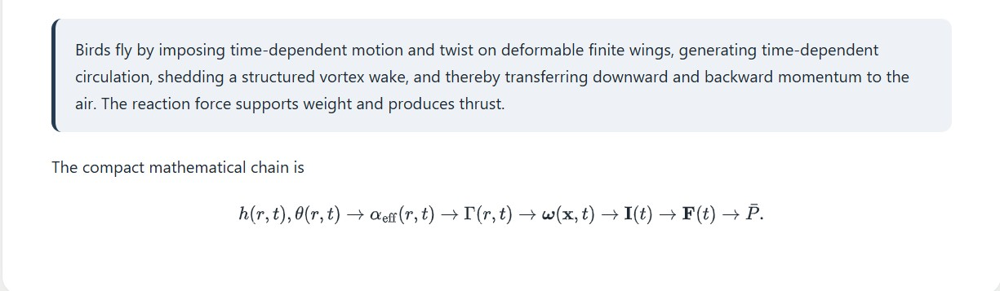

# Bird Flight Physics

Rigorous unsteady aerodynamics of bird wing flapping — full mathematical derivation with an interactive 3D simulation.


*The entire physics chain distilled: from wing kinematics through vortex wake impulse to lift and thrust.*

[**A coherent mathematical derivation of bird wing physics →**](https://az9713.github.io/bird-flight-physics/wing_flapping_physics.html)

https://github.com/user-attachments/assets/17379472-6255-4169-aa53-cbecfa8f64fb


---

## Running the simulations

**Option 1 — Standalone (no install needed)**

Open `wing_flapping_physics.html` directly in Chrome. It contains the full theoretical treatment of bird wing flapping aerodynamics — governing equations, nondimensional analysis, vortex dynamics, Theodorsen model, aeroelasticity — alongside an interactive 3D simulation with parameter sliders and a live physics readout. No build step required.

**Option 2 — Full Next.js site**

```bash
cd site
npm install
npm run dev
```

Open [http://localhost:3000](http://localhost:3000). Navigate to **Wing Flapping** for the complete 18-section mathematical derivation with embedded interactive 3D demo, all equations typeset in KaTeX.

---

## What's in here

| Path | Description |
|---|---|
| `site/` | Next.js 16 education site with full derivation + embedded 3D demo |
| `wing_flapping_physics.html` | Standalone HTML — complete theory, math, and 3D simulation (no install needed) |
| `.claude/skills/sci-math-site/` | Reusable Claude Code skill for this stack |

---

## The site

**Stack:** Next.js 16 · MDX · KaTeX · React Three Fiber · Tailwind CSS

**Pages:**
- `/` — landing page with module cards
- `/physics/wing-flapping` — 18-section rigorous derivation + interactive 3D demo

**Physics covered** (all with full LaTeX derivations):
1. Unsteady Navier–Stokes with moving boundaries
2. Reynolds, Strouhal, and reduced frequency numbers
3. Wing kinematics — heaving, pitching, effective angle of attack
4. Quasi-steady lift model
5. Thrust from force tilt
6. Momentum theory and induced power scaling
7. Vorticity formulation — Kutta–Joukowski, Kelvin's theorem, vortex loops
8. Theodorsen unsteady thin-airfoil model
9. Added mass
10. Wingbeat power curve (U-shaped)
11. Downstroke dominance and feather slotting
12. Leading-edge vortices (LEV) and dynamic stall
13. Spanwise structure and torque
14. Wing twist as an aeroelastic solution
15. Fluid–structure interaction and Cauchy number
16. Wake topology — vortex rings to reverse Kármán street
17. Minimal reduced-order model
18. Deepest physical picture — **F ≈ −dI/dt**

**3D simulation features:**
- Animated bird body + flapping wings with taper, camber, sweep
- 320-particle vortex wake (helix pattern)
- Live force arrows (lift, thrust, drag)
- 5 parameter sliders: frequency, amplitude, speed, twist, wake strength
- Real-time readout: St, Re, α_eff, U_eff, C_L, C_D, L, T, D

---

## The Claude Code skill

`.claude/skills/sci-math-site/` is a reusable [Claude Code](https://claude.ai/code) skill that builds sites like this one for any physics or math topic.

**It handles:**
- Full LaTeX derivation in MDX (remark-math + rehype-katex)
- React Three Fiber 3D visualization with parameter sliders and live readout
- Next.js 16 + Turbopack-specific config (string-based plugin names, no-args `useMDXComponents`, client-side lazy wrappers)

**To use it** in a new Claude Code session, just ask:
> "Build me a page about the double pendulum with Lagrangian mechanics and a 3D chaos simulation"

Claude will pick up the skill automatically and follow its workflow.

**Reference files:**
- `SKILL.md` — main workflow (5 phases: plan → scaffold → build 3D → write MDX → verify)
- `references/stack-setup.md` — exact config, dependencies, Turbopack gotchas
- `references/r3f-patterns.md` — R3F component templates, ArrowHelper, instanced particles
- `references/content-structure.md` — MDX derivation structure and LaTeX patterns

---

## Next modules (planned)

- Wake topology — vortex ring shedding, impulse theorem
- Strouhal explorer — efficient flight regime map across species
- Spanwise circulation — Prandtl lifting-line, elliptic load
- Aeroelastic wing deformation demos
- CFD comparison section
